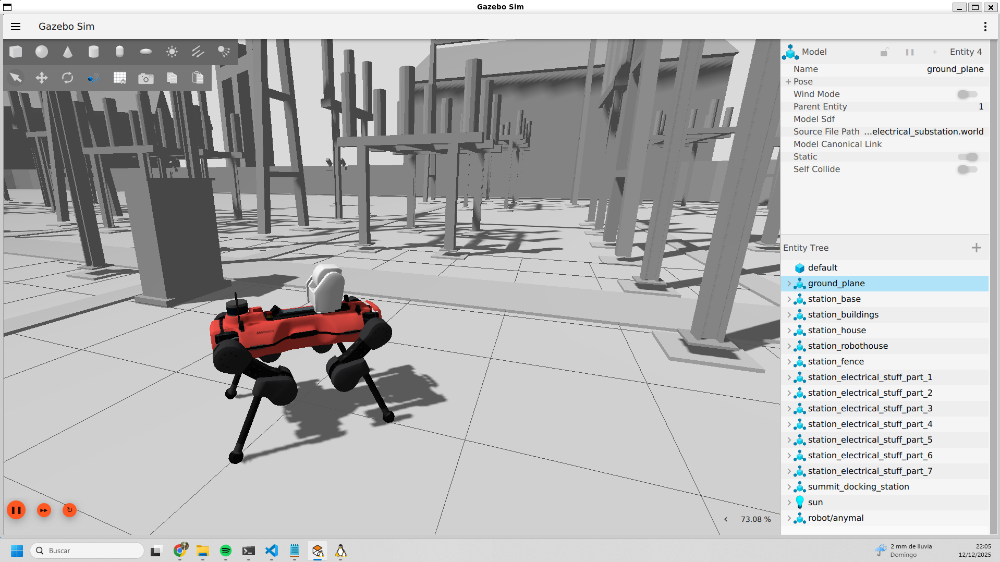
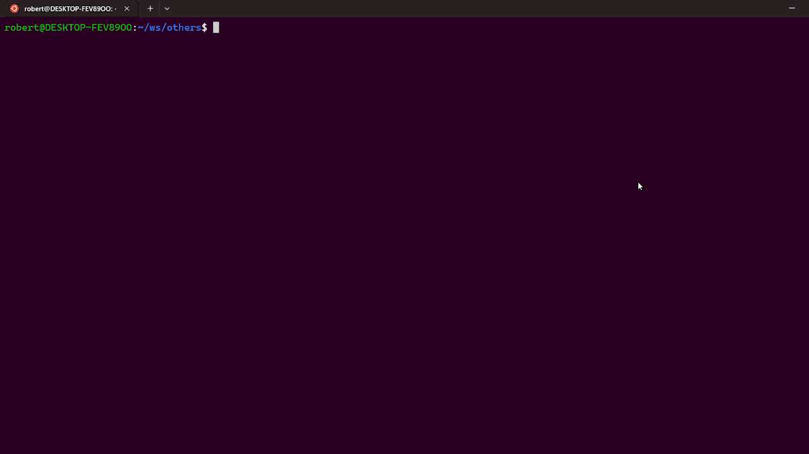

 [](https://github.com/RoboticArts/quadruped_ros2/actions/workflows/ci.yaml) 

# quadruped_ros2

A quadruped robotics framework based on ROS2
focused on simulation development and small real-world prototypes.

<p align="center">

</p>

## 1. Overview

This repository provides a modular framework to develop, simulate, and prototype quadruped robots.

The architecture is designed to:

- 🤖 Support multiple quadruped robots
- 💻 Integrate with different simulators
- ⚙️ Share the same core between simulation and real hardware
- 🚀 Serve as a starting point for research and product prototypes

> **Note:** The current version integrates a single reference quadruped robot and one simulation backend.
> Support for additional quadruped robots and simulators will be progressively added in future releases.

## 2. Quick start
*Requirements: Linux/WSL2, Docker v2.x and X11*


Run the simulation with a single command:

```
wget https://raw.githubusercontent.com/RoboticArts/quadruped_ros2/refs/heads/jazzy/docker/docker-compose.yaml && \
  xhost +local:root || true && \
  docker compose up --pull always
```

<p align="center">

</p>


**Note**: `xhost` temporarily enables GUI access in the current X11 session (Linux). You can revoke it anytime with `xhost -local:root`. Users on WSL2 can ignore it.

## 3. Installation

*Requirements: Ubuntu 24.04, [ROS 2 Jazzy installation](https://docs.ros.org/en/jazzy/Installation/Ubuntu-Install-Debs.html)*

Create the workspace:

```
mkdir -p ~/quadruped_ws/src && cd ~/quadruped_ws/src
```

Clone the repository with submodules:

```
git clone -b jazzy --recurse-submodules https://github.com/RoboticArts/quadruped_ros2.git
```

Install Gazebo transport and ZeroMQ:

```
apt-get update && apt-get install -y curl lsb-release gnupg
```

```
curl https://packages.osrfoundation.org/gazebo.gpg --output /usr/share/keyrings/pkgs-osrf-archive-keyring.gpg && \
    echo "deb [arch=$(dpkg --print-architecture) signed-by=/usr/share/keyrings/pkgs-osrf-archive-keyring.gpg] http://packages.osrfoundation.org/gazebo/ubuntu-stable $(lsb_release -cs) main" \
    | sudo tee /etc/apt/sources.list.d/gazebo-stable.list > /dev/null && \
    apt-get update && apt-get install -y \
    libgz-transport15-dev \
    libzmq3-dev && \
    cppzmq-dev
```

Install ROS dependencies:

```
cd ~/quadruped_ws
rosdep update && rosdep install --from-paths src --ignore-src -y -r --rosdistro jazzy
```

Build the repository:

```
colcon build --symlink-install
source install/setup.bash
```

## 4. Bringup

Source workspace:

```
cd ~/quadruped_ws
source install/setup.bash
```

Launch quadruped robot:

```
ros2 launch quadruped_bringup bringup_complete.launch.py
```

Available arguments:

| Name | Description | Default |
|----------|----------|----------|
| robot_model | Robot model to set related launch and config files | `anymal`   |
| robot_xacro | URDF filename of the related robot model to set multiple variants   | `anymal_d.urdf.xacro`   |
| use_sim | Use simulation or real hardware   |  `true`   |
| headless_sim | Disable GUI systems   | `false`   |
| world_sim | Name of the available worlds located in `modules/simulation/quadruped_gz_worlds`   | `electrical_station.world`   |
| run_rviz | Launch RVIZ 2   | `false`   |

## 5. Docker

*Requirements: [Docker installation](https://docs.docker.com/engine/install/)*

Create the workspace:

```
mkdir -p ~/quadruped_ws/src && cd ~/quadruped_ws/src
```

Clone the repository with submodules:

```
git clone -b jazzy --recurse-submodules https://github.com/RoboticArts/quadruped_ros2.git
```

Build the docker image:
```
cd ~/quadruped_ws/src/quadruped_ros2
docker compose -f docker/docker-compose.dev.yaml build
```

Start docker containers:

```
cd ~/quadruped_ws/src/nano_atom
docker compose -f docker/docker-compose.dev.yaml up
```
Go inside the container:

```
docker exec -it quadruped-ros2 bash
```

## 6. Architecture

## 7. Build and validation

## 8. Related repositories

- 🐈 [`quadruped_locomotion`](https://github.com/RoboticArts/quadruped_locomotion): Locomotion control architecture for quadruped robots, independent of ROS and execution backends.
- 🌉 [`quadruped_locomotion_ros2`](https://github.com/RoboticArts/quadruped_locomotion_ros2) ROS 2 integration layer that adapts the quadruped_locomotion architecture into a ros2_control-based controller.
- 🤖 [`anymal_description`](https://github.com/RoboticArts/anymal_description): Reference quadruped robot description adapted within this framework.

## 9. Acknowledgments

This project acknowledges the following repositories, which either reuse parts of this work or served as references and inspiration during its development:

- [`robotnik_gazebo_worlds`](https://github.com/RobotnikAutomation/robotnik_gazebo_worlds): For electrical station world meshes used in simulation environments.
- [`anymal_d_simple_description`](https://github.com/ANYbotics/anymal_d_simple_description): For reference quadruped robot meshes and URDF structure.
- [`andino`](https://github.com/Ekumen-OS/andino/) :   For README structure and documentation inspiration.
- [`nano_atom`](https://github.com/RoboticArts/nano_atom) : For repository folder organization and project structure reference.


